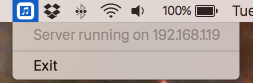

# iTunes Remote for Pebble (OS X App)

Control iTunes playback (play/pause/next/prev) from your Pebble watch!

**(To be used with [Pebble iTunes Remote](https://github.com/macecchi/pebble-itunes-remote) for Pebble)**


This app was built using:

- **[iTunes Control API](https://github.com/macecchi/itunes-control-api)** for iTunes remote control over HTTP
- **[NW.js](https://github.com/nwjs/nw.js)** (former *node-webkit*) for GUI
- **[nw-builder](https://github.com/nwjs/nw-builder)** to export Node.js as OS X app


## How to Use

1. **Download** OS X app
- *(Optional)* Drag app to **Applications** folder
- **Double click** to open
- Click on the **status bar** icon and take note of the IP address shown

	
- Go to the **Pebble app** on your phone and type the IP address inside 'iTunes Remote' configurations
- Enjoy!


## Manual compiling

```bash
$ cd pebble-itunes-remote-osx
$ npm install
$ npm install -g node-webkit nw-builder
$ nwbuild -p osx64 .
```